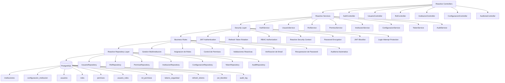

# Reactive Backend Workflow

## Objetivo

Desarrollar la lógica backend reactiva completa utilizando Spring WebFlux + R2DBC + PostgreSQL para gestión multiinstitución, autenticación JWT, control RBAC, auditoría avanzada y administración reactiva de usuarios, roles, permisos e instituciones.

## Reglas Obligatorias

- Mantener estrictamente el estándar actual de carpetas y arquitectura existente.
- No modificar estructura base, naming conventions, organización modular ni flujo actual del proyecto.
- Toda implementación debe integrarse respetando los patrones ya definidos.
- No crear nuevas arquitecturas paralelas ni reorganizar packages existentes.
- Mantener consistencia con DTOs, responses, exceptions, mappers y convenciones actuales.

---

# Backend Workflow



---

# Lógica Backend Requerida

## Instituciones

- CRUD reactivo completo.
- Validar unicidad:
  - uuid
  - nombre
  - codigo_modular
- Manejo de:
  - activa
  - logo_url
  - emails secundarios
  - teléfonos secundarios
- Actualización automática de timestamps.
- Registro automático en auditoría.

---

## Configuración Institucional

- Relación única por institución.
- Validar:
  - colores HEX
  - horarios válidos
  - moneda ISO
  - rangos permitidos
- Gestión reactiva de configuraciones académicas y visuales.

---

## Usuarios

- Registro reactivo de usuarios.
- Hash seguro de contraseñas.
- Email único por institución.
- Manejo de estados:
  - activo
  - inactivo
  - suspendido
  - pendiente
- Gestión de:
  - email_verificado
  - requiere_cambio_pwd
  - intentos_fallidos
  - bloqueado_hasta
  - ultimo_acceso
- Bloqueo automático por intentos fallidos.

---

## Roles y Permisos

- CRUD reactivo de roles.
- Protección de roles del sistema.
- Asignación:
  - usuario ↔ roles
  - rol ↔ permisos
- Validación RBAC reactiva por módulo y acción.

---

## Seguridad

### JWT

- Generación de access token.
- Validación reactiva.
- Manejo de JTI.
- Invalidación mediante blocklist.

### Refresh Tokens

- Rotación de tokens.
- Revocación reactiva.
- Manejo de familias de tokens.
- Registro de IP y user-agent.

### Tokens de Seguridad

Implementar:

- recuperación de contraseña
- verificación de email
- invitaciones

Validar:

- expiración
- reutilización
- uso único

---

## Auditoría

Registrar automáticamente:

- INSERT
- UPDATE
- DELETE
- LOGIN
- LOGOUT
- LOGIN_FAILED

Guardar:

- usuario
- tabla
- registro
- IP origen
- user agent
- datos anteriores
- datos nuevos

Usar JSONB para trazabilidad completa.

---

# Stack Técnico

- Java 21
- Spring Boot 3
- Spring WebFlux
- Spring Security Reactive
- R2DBC PostgreSQL
- Project Reactor
- JWT Authentication
- Reactive Validation
- Global Exception Handling
- Arquitectura no bloqueante

```

```
